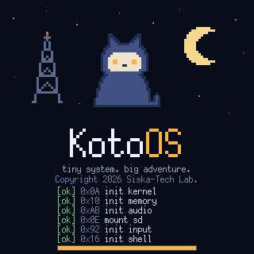
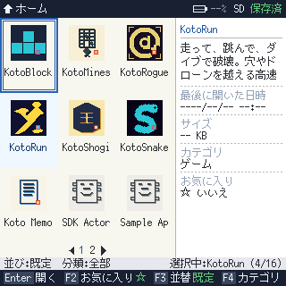
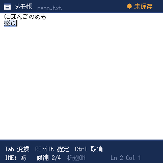
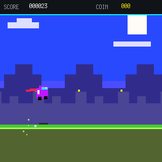
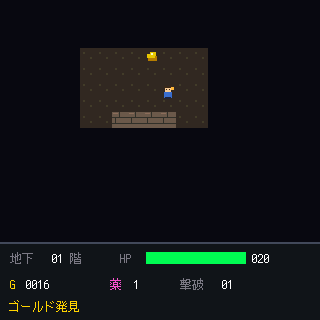
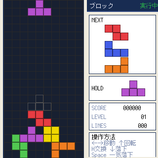
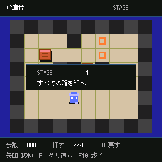

# KotoOS v0.2

KotoOS is a lightweight Japanese PDA environment, game platform, and small-app
runtime for the ClockworkPi PicoCalc, written in Rust. Version 0.2 supports
both the original RP2040 Pico profile and the RP2350A Pico 2 W profile on real
hardware.

It ships a portable shell, a bytecode app runtime with its own compiler
toolchain, an SKK-based Japanese IME, a retained-mode graphics pipeline, and a
two-core audio service — all running both on real PicoCalc hardware
(`koto-pico` firmware) and in a desktop simulator (KotoSim) that shares the
same core crates.

## OpenAI Build Week

KotoOS was developed with extensive use of Codex and GPT-5.6 for implementation,
architecture, debugging, performance investigation, testing, and documentation.

See [How Codex & GPT-5.6 were used](#how-codex--gpt-56-were-used) for details.

## Version 0.2 Highlights

- **Pico 2 W support:** RP2350A firmware, linker/UF2 profiles, PicoCalc LCD,
  keyboard, audio, SD, power, and external PSRAM paths are hardware-validated.
- **KotoIDE tooling:** the repository includes a VS Code extension with Koto
  syntax highlighting, live diagnostics and definitions through `koto-lsp`,
  app scaffolding, and custom sprite, icon, tilemap, and KotoMML editors.
- **Retained graphics and full-color assets:** apps can use retained tilemaps
  and stream full-resolution 320×320 RGB565 images without palette or spatial
  reduction. The sample gallery includes fades, wipes, and looping SLD4 music.
- **Native KotoAudio path:** package audio assets, KotoMML audition tooling,
  encoded SLD4 streaming, and the two-core device audio service share one
  runtime model across PicoCalc and KotoSim.
- **Faster SD storage:** cards are initialized with a bounded low-speed retry
  sequence and promoted through a CRC-validated transfer-clock ladder up to
  25 MHz. The validated RP2350A card reached 915 KiB/s.

See [CHANGELOG.md](CHANGELOG.md) for the release summary.

## Screenshots

All frames below are captured from KotoSim, which renders the same 320×320
frames as the device.

| Boot splash | Home shell | Memo + SKK IME |
| :---: | :---: | :---: |
|  |  |  |

| KotoRun | KotoRogue | KotoBlocks | Sokoban |
| :---: | :---: | :---: | :---: |
|  |  |  |  |

## Documentation

The documentation tree is indexed in [docs/README.md](docs/README.md). The
most important source documents are:

- [Requirements](docs/planning/REQUIREMENTS.md)
- [Research](docs/planning/Research.md)
- [Architecture](docs/architecture/ARCHITECTURE.md)
- [HAL API Draft](docs/architecture/HAL_API.md)
- [RP2040 Bring-Up Plan](docs/hardware/RP2040_BRINGUP.md)
- [RP2350 / Pico 2 Support Roadmap](docs/planning/RP2350_SUPPORT_ROADMAP.md)
- [Implementation Status](docs/planning/IMPLEMENTATION_STATUS.md)
- [KPA Package Format](docs/spec/KPA_FORMAT.md)
- [Bytecode App Development Roadmap](docs/planning/BYTECODE_APP_DEV_ROADMAP.md)
- [Validation Plan](docs/planning/VALIDATION_PLAN.md)
- [Traceability](docs/planning/TRACEABILITY.md)
- [Issues](docs/ISSUES_main.md)

## Current Development Stance

- Keep the constrained RP2040 as the lower-bound profile while treating the
  Pico 2 W/RP2350A artifact as a hardware-validated release target.
- Use Rust as the primary implementation language.
- Keep core logic portable between KotoSim and PicoCalc.
- Treat PSRAM as block-transfer storage on RP2040, not memory-mapped RAM.
- Use Pico Plus 2(W) onboard PSRAM behind the same bounded HAL contract so
  mapped pointers and board addresses do not leak into portable core code.
- Prefer measurable harnesses before hardware-specific optimization.
- Keep completed simulator baseline work separate from active embedded bring-up
  and cleanup issues in [Issues](docs/ISSUES_main.md).

## Local Checks

Run the standard local CI checks:

```powershell
python harness\check_all.py
```

This runs Rust formatting, Clippy, tests, and the project harness. It exits non-zero as soon as any check fails.

Run only the dependency-free project harness when iterating on repository metadata:

```powershell
python harness\check_project.py
```

The simulator scans binary packages from `sdcard_mock/apps/*.kpa`; each archive embeds its manifest, bytecode, icon, sprites/images, audio, and declared data assets.

Run KotoSim with the committed package set:

```powershell
cargo run -p koto-sim
```

The source-install instructions for the KotoIDE VS Code extension are in
[`tools/vscode-koto/README.md`](tools/vscode-koto/README.md).

## PicoCalc Firmware Builds

The embedded backend is an explicit workspace member but not a default member,
so ordinary host tests do not compile Pico dependencies.

### RP2040 / Pico

Install the RP2040 target and UF2 converter once:

```powershell
rustup target add thumbv6m-none-eabi
cargo install elf2uf2-rs
```

Build the product firmware:

```powershell
cargo build -p koto-pico --bin koto_firmware `
  --target thumbv6m-none-eabi --release
```

Create a UF2 without flashing it automatically:

```powershell
elf2uf2-rs target\thumbv6m-none-eabi\release\koto_firmware `
  target\thumbv6m-none-eabi\release\koto_firmware-picocalc-pico-rp2040.uf2
```

Copy the generated UF2 to the module in BOOTSEL mode.

### RP2350A / Pico 2 W

Pico 2 W is the first RP2350 hardware target (KOTO-0204). Install its Rust
target and Raspberry Pi's official `picotool` 2.x, then build the board-named
UF2:

```powershell
rustup target add thumbv8m.main-none-eabihf
$env:PICOTOOL = "C:\path\to\picotool.exe"
tools\build-rp2350a.ps1
```

The output is
`target/thumbv8m.main-none-eabihf/release/koto_firmware-picocalc-pico2w-rp2350a.uf2`.
The build selects `board-picocalc-pico2w` (which owns the internal
`mcu-rp235xa` selection), uses the Pico 2 W 4 MiB flash / 520 KiB SRAM
linker profile, identifies itself as `picocalc-pico2w-rp2350a` in the UART
banner, and leaves wireless initialization disabled. The product firmware and
retained peripheral probes have passed the PicoCalc hardware validation gate.

To cross-check every retained embedded binary for RP2040 and RP2350A:

```powershell
python harness\check_embedded.py
```

For the KOTO-0205 device gate, generate the product image, every retained
peripheral probe, and the forced PSRAM-fallback image together:

```powershell
tools\build-rp2350a.ps1 -ValidationBundle
```

Run and record them in the order defined by
[`RP2350A_PICOCALC_VALIDATION.md`](docs/hardware/RP2350A_PICOCALC_VALIDATION.md).

The retained single-peripheral probes are `probe_lcd`, `probe_keyboard`,
`probe_sd`, `probe_psram`, `probe_power`, and `probe_audio`. See
[`src/koto-pico/README.md`](src/koto-pico/README.md) for their purpose and build
commands.

## How Codex & GPT-5.6 were used

KotoOS was developed with extensive assistance from Codex and GPT-5.6 as
engineering partners throughout the project.

They were used for:

- Exploring and implementing Rust / Embassy embedded designs
- Refactoring the firmware into reusable `no_std` subsystems
- Designing and extending the Koto VM, compiler, and application language
- Implementing and reviewing KotoUI, SDK APIs, and bounded resource models
- Investigating performance bottlenecks using real hardware measurements
- Iterating on PIO, DMA, PSRAM, graphics, audio, and SD card code
- Porting KotoOS from RP2040 to RP2350A while preserving compatibility
- Building simulator and developer-tool workflows
- Writing regression tests, validation tools, architecture documents, and
  implementation plans

The development process was highly iterative.

For hardware-related work, generated or modified code was tested on real
PicoCalc hardware, measurements and logs were fed back into the development
process, and the implementation was revised based on the observed behavior.

This was especially important for areas such as PSRAM performance, display
transfer costs, audio scheduling, SD card timing, and RP2350A hardware support,
where code that looked correct in isolation was not necessarily correct or
fast enough on the physical device.

Codex was particularly useful for working across the large repository,
implementing changes, running tests, tracing dependencies, and carrying out
multi-file refactors.

GPT-5.6 was used extensively for architectural reasoning, debugging strategies,
design reviews, API design, performance analysis, and planning the next
iterations of the system.

The project therefore evolved through a repeated loop:

**design → implement → build → test on simulator → test on hardware → measure →
analyze → refine**

AI accelerated this loop significantly, but real-hardware validation remained
the source of truth for embedded behavior and performance.

## License

Licensed under either of

- Apache License, Version 2.0 ([LICENSE-APACHE](LICENSE-APACHE) or
  http://www.apache.org/licenses/LICENSE-2.0)
- MIT license ([LICENSE-MIT](LICENSE-MIT) or
  http://opensource.org/licenses/MIT)

at your option.

Unless you explicitly state otherwise, any contribution intentionally
submitted for inclusion in the work by you, as defined in the Apache-2.0
license, shall be dual licensed as above, without any additional terms or
conditions.

### Acknowledgements

- JBlanked's [Picoware](https://github.com/jblanked/Picoware/) project
  provided a valuable reference for PicoCalc-specific PSRAM initialization
  behavior and QPI performance experiments. Parts of KotoOS's earlier
  in-tree QPI PSRAM experiments and diagnostic code were informed by
  Picoware.

- KotoOS's current default PSRAM backend uses the vendored Rust
  [koto-psram](https://github.com/siska-tech/koto-psram) crate, which was
  developed separately, retained under `src/koto-psram`, and integrated
  through `psram_ext`.

### Bundled assets

- `assets/fonts/mplus10.kfont` / `mplus12.kfont` are converted from the
  [M+ BITMAP FONTS](https://mplusfonts.github.io/) (Copyright 2002-2005 COZ),
  distributed under their own free license; see
  [assets/fonts/LICENSE_J](assets/fonts/LICENSE_J) and
  [assets/fonts/LICENSE_E](assets/fonts/LICENSE_E).
- `sdcard_mock/dict/skk_koto.skk` is an original SKK-format dictionary written
  from scratch for KotoOS and dedicated to the public domain under
  CC0 1.0 Universal. It is not derived from any SKK-JISYO file.
