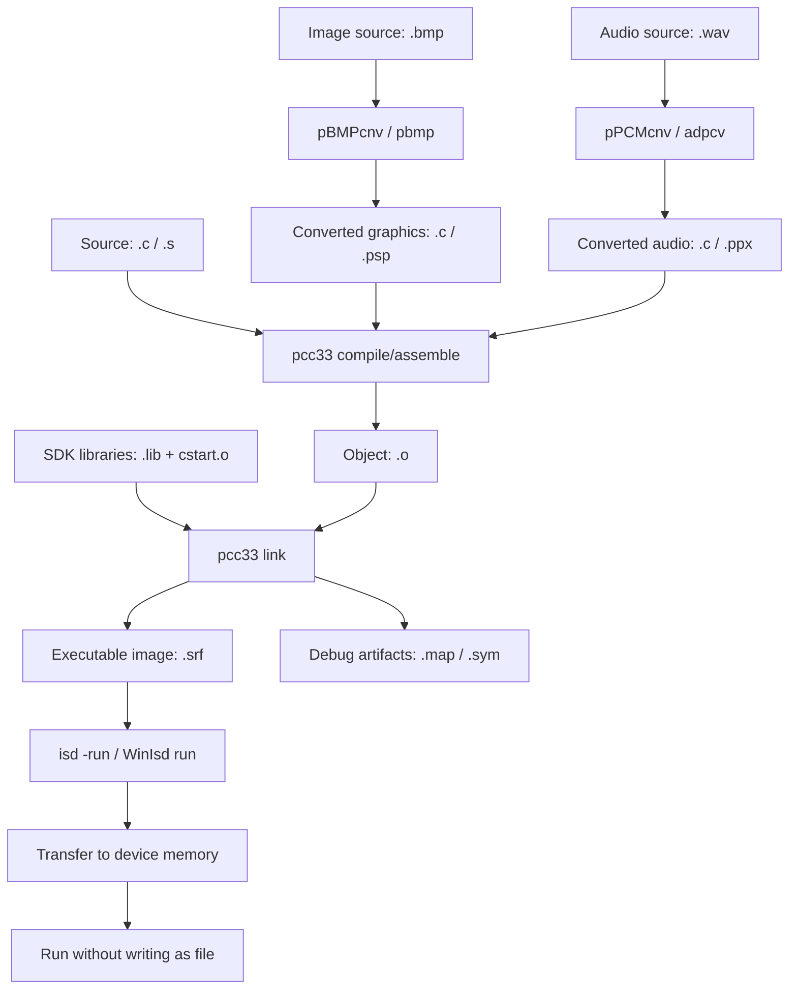
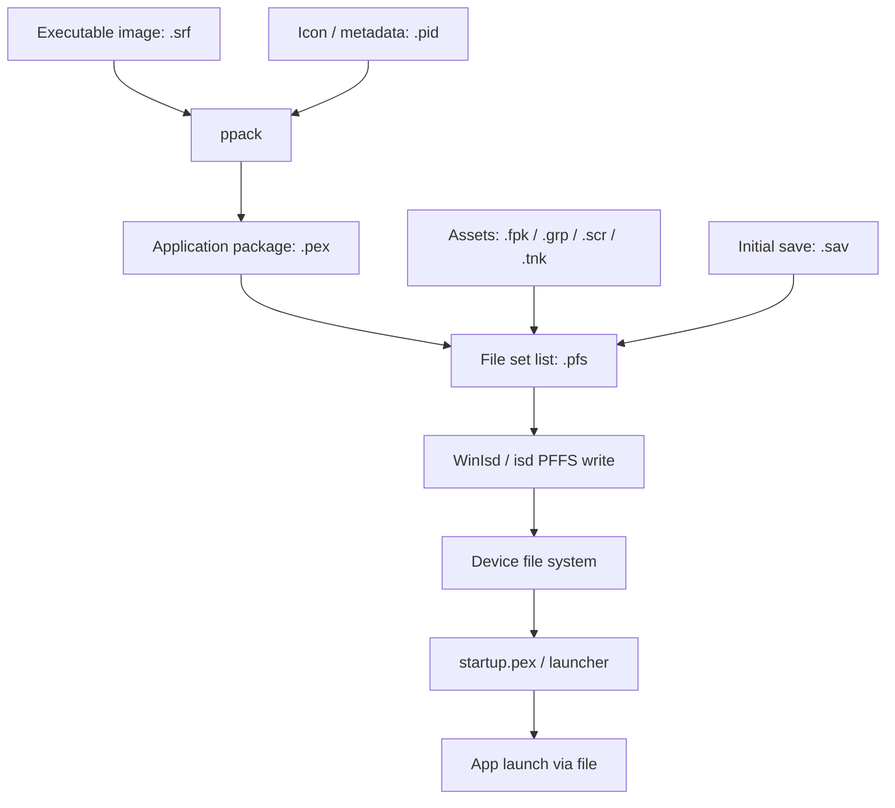
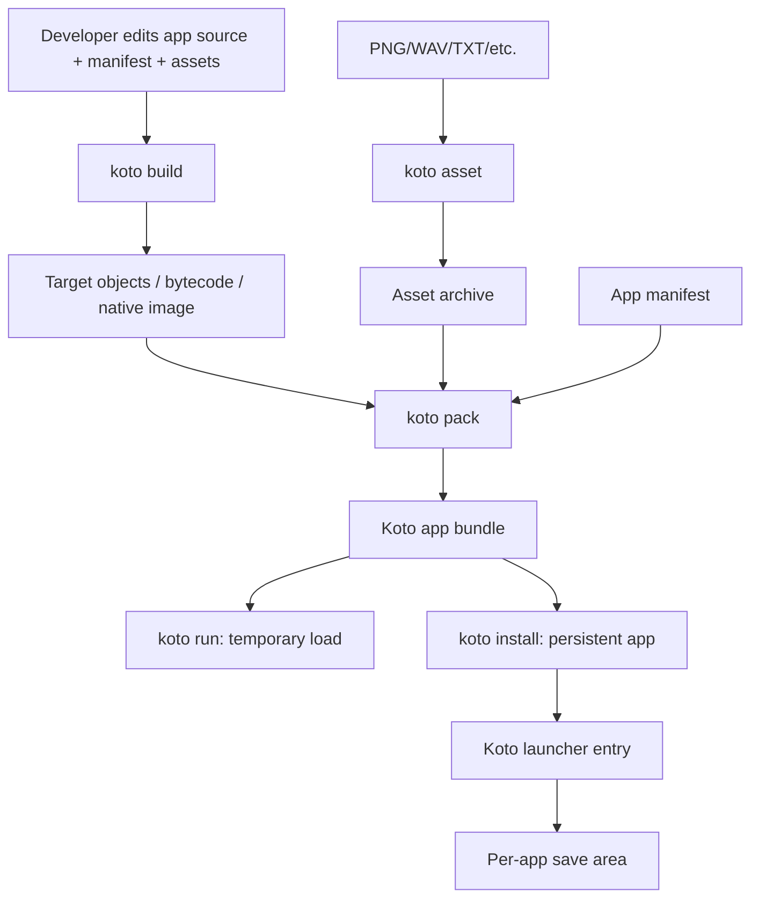

# P/ECE SDK Developer Experience Deep Dive for KotoOS

## 0. Scope and Clean-Room Note

この文書は `C:\USR\PIECE` 配下のP/ECE SDKを、KotoOS設計研究のために「開発者体験」と「実行物の流れ」へ分解した調査メモである。P/ECE互換や移植は目的にしない。ソース、ヘッダ、文書、素材、定義、コメントはKotoOSへコピーせず、ここではファイルパス、ツール名、成果物拡張子、依存関係、設計上の観察だけを独自表現でまとめる。

重点的に確認した範囲は、`app/simple_hello`、`app/simple`、`app/menu`、`app/sprite`、`app/adpcm`、`app/tank`、`bin`、`include`、`lib`、`docs/API`、`docs/SIMPLE`、`docs/TOOLS`、`tools/isd`、`tools/filepack`、`tools/PBMPcnv`、`tools/PPCMcnv` である。

## 1. P/ECEアプリ開発フロー

### 1.1 最小サンプルで編集するもの

最小系の `app/simple_hello` と `app/simple` は、初心者が直接触るファイルを強く絞っている。主に編集対象になるのは `prog.c` と `prog.txt` で、画像を含む場合は `pat.bmp` が追加される。`prog.txt` はサンプル内で読み込まれる短いテキスト断片で、`app/simple_hello/prog.txt` と `app/simple/prog.txt` に存在する。`app/simple_hello/prog.c` と `app/simple/prog.c` は `simple.h` を使う構成で、P/ECEの低レベルLCD/Pad/APIを直接見せるのではなく、簡易APIの上で入門させる設計になっている。

根拠ファイル:

- `app/simple_hello/prog.c`
- `app/simple_hello/prog.txt`
- `app/simple_hello/pat.bmp`
- `app/simple_hello/makefile`
- `app/simple/prog.c`
- `app/simple/prog.txt`
- `app/simple/makefile`
- `include/simple.h`
- `docs/SIMPLE/index.html`

KotoOSへの示唆: 最小サンプルは「main相当の1ファイル」と「画面に出すテキスト/小さな素材」だけを触れば動く形にするとよい。低レイヤの画面バッファ、周期処理、入力ポーリングは、入門段階では薄いラッパーの裏に隠す。

### 1.2 makefile/batの使い方

重点サンプルの多くは各ディレクトリ直下に `makefile` を持つ。`app/simple_hello/makefile`、`app/simple/makefile`、`app/sprite/makefile`、`app/adpcm/makefile`、`app/menu/makefile`、`app/tank/makefile` は、同じ基本パターンでCソースを `.o` にし、複数 `.o` を `.srf` にリンクし、必要に応じて `ppack` で `.pex` にする。`bin/build.bat` は通常ビルドでは `make`、リビルド指定では `make clean` の後に `make` を呼ぶ。`app/tank/a.bat` は `make` 後に `run tank` を呼び、`app/tank/c.bat` はクリーンビルド用の薄いラッパーである。

根拠ファイル:

- `app/simple_hello/makefile`
- `app/simple/makefile`
- `app/sprite/makefile`
- `app/adpcm/makefile`
- `app/menu/makefile`
- `app/tank/makefile`
- `bin/build.bat`
- `bin/run.bat`
- `app/tank/a.bat`
- `app/tank/c.bat`

開発者体験としては、各サンプルが自己完結したビルドディレクトリになっており、SDK共通ツールは `bin` に寄せられている。KotoOSでも、サンプルごとの `Makefile`/設定ファイルと、共通CLIを分離すると学習しやすい。

### 1.3 使われるコンパイラ/リンカ/変換ツール

各サンプルの `makefile` から見ると、Cコンパイル、アセンブル、リンクの入口は `pcc33` に集約されている。`pcc33` は `bin/pcc33.exe` と `bin/pcc33.cfg` があり、設定ファイルには標準的にリンクされるライブラリの並びが書かれている。`bin` には下位ツールとして `cpp.exe`、`cc1.exe`、`as33.exe`、`lk33.exe`、`lib33.exe` も含まれるため、`pcc33` はフロントエンド的な役割を持つと見られる。

画像変換は `pBMPcnv.exe` / `PBMPcnv` 系が担当する。`app/simple_hello/makefile` では `pat.bmp` から `pat.c` と `pat.psp` が作られている。ツール文書 `docs/TOOLS/pBMPcnv.htm` はBMPをP/ECE用グラフィックデータへ変換するツールとして説明している。

音声変換は `pPCMcnv.exe` / `PPCMcnv` 系が担当する。`app/adpcm` では `ose16.wav`、`ose16.ppx`、`ose16.c` が並び、`docs/TOOLS/pPCMcnv.htm` はWAVをP/ECE用音声データへ変換するツールとして説明している。

アプリパッケージ化は `ppack.exe` が担当する。各makefileの `pex` ターゲットは `.srf` を入力にして `.pex` を作る。`app/tank/makefile` ではアイコンと思われる `.pid` も `ppack` に渡される。

転送/開発実行は `isd.exe` と `WinIsd.exe` が担当する。`bin/run.bat` は `isd -run` を呼ぶ。`tools/isd/isd.c` と `tools/isd/isdcom.c` には `.srf` を読み込んで実機へ流す経路があり、`tools/isd/pieceif.dll` / `tools/isd/pieceif.c` / `drivers` 系がUSB接続を支える。

根拠ファイル:

- `bin/pcc33.exe`
- `bin/pcc33.cfg`
- `bin/as33.exe`
- `bin/lk33.exe`
- `bin/ppack.exe`
- `bin/pBMPcnv.exe`
- `bin/pPCMcnv.exe`
- `bin/isd.exe`
- `bin/WinIsd.exe`
- `docs/TOOLS/pBMPcnv.htm`
- `docs/TOOLS/pPCMcnv.htm`
- `docs/TOOLS/WinIsd.htm`
- `tools/isd/isd.c`
- `tools/isd/isdcom.c`
- `tools/isd/pieceif.c`

### 1.4 中間ファイル/最終ファイル

典型的なビルドでは、編集ソース `.c` と変換済み素材 `.c` から `.o` が作られ、リンク後に `.srf`、`.map`、`.sym` が生成される。`.srf` は開発時に `isd -run` で直接転送/実行できる形式として扱われる。一方、`.pex` は `ppack` が `.srf` から作る配布/登録向けアプリ形式に見える。`app/pex` には複数アプリの `.pex`、`.pfs`、`.sav`、`.fpk`、`.tnk` が集められており、実機へ置くファイルセットの置き場として使われている。

根拠ファイル:

- `app/simple_hello/prog.o`
- `app/simple_hello/prog.srf`
- `app/simple_hello/prog.map`
- `app/simple_hello/prog.sym`
- `app/simple_hello/pat.psp`
- `app/adpcm/ose16.ppx`
- `app/tank/tank.pex`
- `app/tank/tank.pfs`
- `app/tank/tb.pid`
- `app/pex/tank.pex`
- `app/pex/bwings.fpk`

### 1.5 実機転送または実行までの流れ

P/ECE SDKには、開発時実行とファイルとしての導入という二つの流れがある。

開発時実行は、`make` で `.srf` を作り、`run` または `isd -run` で実機メモリへ転送して実行する流れである。`docs/TOOLS/WinIsd.htm` でも、実行ファイル `.srf` をP/ECEのメモリへ転送して実行し、ファイルとしては書き込まない趣旨が説明されている。`bin/run.bat` と `tools/isd/isd.c` がこの経路の根拠になる。

配布/常駐導入は、`ppack` で `.pex` を作り、WinIsdなどでP/ECEファイルシステムへ書き込む流れである。複数ファイルをまとめて書き込むときは `.pfs` がファイルセットリストとして使われる。`app/tank/tank.pfs` は `tank.pex` と複数 `.tnk` を並べ、`app/BlackWings/bwings.pfs` は `.pex`、`.fpk`、`.sav` を並べ、`app/odemaru/odemaru.pfs` は `.pex`、グラフィック、セーブ、スクリプトらしきファイルを並べる。`docs/TOOLS/WinIsd.htm` は `.pfs` を必要ファイルのリストとして扱う導線を示している。

根拠ファイル:

- `bin/run.bat`
- `tools/isd/isd.c`
- `tools/isd/isdcom.c`
- `docs/TOOLS/WinIsd.htm`
- `app/tank/tank.pfs`
- `app/BlackWings/bwings.pfs`
- `app/odemaru/odemaru.pfs`

## 2. 代表サンプル別の構成比較

| サンプル | パス | 目的 | 主なソースファイル | 主なリソース | 使用していると思われるAPIカテゴリ | 生成物 | KotoOSサンプル設計への示唆 |
|---|---|---|---|---|---|---|---|
| simple_hello | `app/simple_hello` | SIMPLE層を使った最小表示/待機サンプル | `prog.c`、変換後の `pat.c` | `prog.txt`、`pat.bmp`、`pat.psp` | SIMPLE、テキスト表示、待機、画像/パターン変換 | `prog.o`、`pat.o`、`prog.srf`、`prog.map`、`prog.sym`、makefile上は `prog.pex` も想定 | 入門サンプルは低レイヤAPIを隠し、編集ファイルを `prog.c` と小さな資源に限定する。根拠: `app/simple_hello/makefile`、`include/simple.h`、`docs/SIMPLE/index.html` |
| simple | `app/simple` | SIMPLE層の基本機能をもう少し広く見せるサンプル | `prog.c`、`pat.c`、派生例として `org/simple.c`、`org/thread.c` | `prog.txt`、`pat.c`、派生ディレクトリのBMP/ライブラリ | SIMPLE、スプライト風表示、Pad、描画、待機、内部的にはLCD/Timer/Vectorの隠蔽 | `prog.o`、`pat.o`、`prog.srf`、`prog.map`、`prog.sym`、派生例では `prog.pex` | 初心者APIの裏側に、実は実機APIとスプライト/タイマ補助がある。KotoOSも「やさしい層」と「詳細層」を分けるべき。根拠: `app/simple/makefile`、`app/simple/org/simple.c` |
| sprite | `app/sprite` | スプライト/BG風描画と直接フレーム転送のデモ | `sprtest.c`、`pat.c` | `pat.bmp` | アプリ生命周期、LCDバッファ、LCD直接転送、Sprite/BG、Timer計測 | `sprtest.srf`、makefile上は `sprtest.pex` も想定 | ゲーム向けには、LCDプリミティブだけでなく、タイル/BG/スプライト相当の中間層が有効。根拠: `app/sprite/sprtest.c`、`include/pclsprite.h`、`docs/API/sprite.html` |
| adpcm | `app/adpcm` | ADPCM/波形再生とPad操作のデモ | `hello.c`、`ose16.c` | `ose16.wav`、`ose16.ppx` | アプリ生命周期、LCD/Font、Pad、Wave/音声出力 | `hello.o`、`ose16.o`、`hello.srf`、`hello.map`、`hello.sym`、makefile上は `hello.pex` も想定 | 音声サンプルは「WAV変換済みデータ」と「再生API」の両方を示す必要がある。KotoOSでも音素材変換CLIと再生APIを対で用意したい。根拠: `app/adpcm/makefile`、`app/adpcm/ose16.wav`、`docs/TOOLS/pPCMcnv.htm` |
| menu | `app/menu` | ランチャー/システムメニュー相当 | `menu.c`、`launch.c`、`launch.h` | `0ism.par` | アプリ生命周期、LCD/Font、Pad、File検索/読み書き、アプリ起動、USB再接続、電源、時刻、CPU速度 | `startup.srf`、`startup.map`、`startup.sym`、makefile上は `startup.pex` も想定 | ランチャーは単なるUIではなく、ファイル列挙、アプリ起動、USB復帰、電源/CPU制御を束ねるシステムアプリ。KotoOSでも最初から権限境界を意識する。根拠: `app/menu/launch.c`、`app/menu/menu.c`、`docs/API/pceAppExecFile.html` |
| tank | `app/tank` | 複数ソース/素材/セーブ/音楽を持つ大きめのゲーム例 | `main.c`、`menu1.c`、`menu2.c`、`program.c`、`battle.c`、`sound.c`、`se.c`、`t.c` | `tb.bmp`、`tb.pid`、`title_bmp.c`、`font12.c`、`snd/*.dat`、`snd/i_*.h`、`se/*.wav`/変換済みC、`*.tnk` | アプリ生命周期、LCD/描画、Font、Pad、File/Save、Wave、muslib、電源、時刻 | `tank.pex`、`tank.pfs`、`tb.pid`、複数 `.tnk`、make上は `tank.srf` | 実践サンプルは、実行本体、アイコン、保存/追加データ、音楽、効果音を分離している。KotoOSのパッケージ形式は複数資源と保存領域を第一級に扱うべき。根拠: `app/tank/makefile`、`app/tank/tank.pfs`、`app/tank/main.c`、`app/tank/se.c` |

## 3. 成果物ファイル形式の推定整理

| 拡張子 | どこで出てくるか | 何に使われていそうか | 開発フロー上の位置 | KotoOSで対応するなら |
|---|---|---|---|---|
| `.c` | `app/*/*.c`、変換済み素材として `app/simple_hello/pat.c`、`app/adpcm/ose16.c`、`app/tank/title_bmp.c` | 人間が書くアプリ本体、またはツールが生成した埋め込み素材 | 入力ソース。`pcc33` で `.o` へ | Rust/C/その他のアプリソース、または生成コード。ただしKotoOSでは素材はバイナリ資源として分離したい |
| `.h` | `include/*.h`、`app/menu/launch.h`、`app/tank/main.h` | 公開API、サンプル内共有定義、ライブラリインターフェース | コンパイル時依存 | KotoOS SDKの公開API定義/型情報。P/ECEヘッダは流用しない |
| `.o` | `app/simple_hello/prog.o`、`app/adpcm/hello.o`、`lib/cstart.o` | コンパイル済みオブジェクト | `.c`/`.s` から作られ、リンクで `.srf` へ | ターゲット用オブジェクト/中間成果物 |
| `.lib` | `lib/pceapi.lib`、`lib/simple.lib`、`lib/sprite.lib`、`lib/muslib.lib` | 実機API、簡易API、スプライト、音楽などの静的ライブラリ | リンク時依存。`bin/pcc33.cfg` に標準ライブラリ順がある | KotoOSランタイムライブラリ、SDKクレート/静的ライブラリ |
| `.srf` | `app/simple_hello/prog.srf`、`app/sprite/sprtest.srf`、`app/menu/startup.srf` | リンク後の実行形式。開発時に `isd -run` でメモリ転送/実行される | `.o` 群から生成。`.pex` の入力にもなる | 開発時ロード用イメージ、デバッグ実行形式 |
| `.map` | `app/simple_hello/prog.map`、`app/tank` ではmakefile上生成想定 | リンク結果のメモリ配置/参照確認 | `.srf` と一緒に生成 | デバッグ/サイズ解析用マップ |
| `.sym` | `app/simple_hello/prog.sym`、`app/menu/startup.sym` | シンボル情報 | `.srf` と一緒に生成 | デバッガ/クラッシュ解析用シンボル |
| `.pex` | `app/tank/tank.pex`、`app/pex/*.pex`、`app/menu2/startup.pex` | パック済みアプリ本体。ファイルシステムへ置いてランチャーから起動する形式と思われる | `.srf` を `ppack` で変換 | KotoOSアプリパッケージ本体、または実行モジュール |
| `.pfs` | `app/tank/tank.pfs`、`app/BlackWings/bwings.pfs`、`app/odemaru/odemaru.pfs`、`app/pex/*.pfs` | P/ECEへ一括転送する関連ファイルリスト | `.pex` と資源/保存データをまとめて導入する段階 | KotoOSのパッケージマニフェスト/インストールリスト |
| `.pid` | `app/tank/tb.pid`、`app/ir/ir.pid`、`app/menu2/P.PID` | `ppack` に渡されるアイコン/アプリ識別画像と思われる | `.pex` 作成時のメタデータ/アイコン入力 | KotoOSアプリアイコン/ランチャーメタデータ |
| `.sav` | `app/BlackWings/bwings.sav`、`app/odemaru/odemaru.sav`、`app/pex/*.sav` | ゲーム/アプリ保存データ | アプリ導入後または初期データとして同梱 | アプリごとの保存領域、初期セーブデータ |
| `.img` | `update/pceboot.img`、`update/pcekn.img`、`update/all.img`、`update/*font*.img` | ブート/カーネル/フォントなどのシステム更新イメージ | システム更新段階 | KotoOSファームウェアイメージ、フォント領域、更新パッケージ |
| `.psp` | `app/simple_hello/pat.psp`、`app/simple_mc/*.psp` | BMPから作られるP/ECE向けグラフィック資源と思われる | 画像変換後、ソース/実行物へ取り込む前後 | KotoOS画像/タイル資源形式 |
| `.ppx` | `app/adpcm/ose16.ppx` | WAVから作られるP/ECE向け音声資源と思われる | 音声変換後、`ose16.c` と併用 | KotoOS音声クリップ/圧縮音声資源 |
| `.fpk` | `app/BlackWings/bwings.fpk`、`app/pex/inauro.fpk` | 複数ファイルを1つにまとめるFilePack系資源 | 大規模アプリの資源集約 | KotoOSアセットアーカイブ |
| `.tnk` | `app/tank/*.tnk`、`app/tank/TANK_DATA/*.tnk`、`app/pex/*.tnk` | Tank用のユーザ/ゲームデータ | `.pfs` で `.pex` と一緒に転送 | アプリ固有データファイル |
| `.bmp` / `.wav` | `app/simple_hello/pat.bmp`、`app/tank/tb.bmp`、`app/adpcm/ose16.wav` | PC側で編集する素材元 | 変換ツールの入力 | 標準素材入力。KotoOSでも一般形式を入力にしたい |

## 4. SDKツールチェーンの流れ

### 4.1 ビルドから開発時実行まで

根拠ファイル:

- `app/simple_hello/makefile`
- `app/adpcm/makefile`
- `app/sprite/makefile`
- `bin/pcc33.exe`
- `bin/pcc33.cfg`
- `bin/isd.exe`
- `bin/run.bat`
- `docs/TOOLS/WinIsd.htm`
- `tools/isd/isd.c`

### 4.2 パッケージ化から実機ファイルシステム導入まで

根拠ファイル:

- `app/tank/makefile`
- `app/tank/tb.pid`
- `app/tank/tank.pfs`
- `app/BlackWings/bwings.pfs`
- `app/odemaru/odemaru.pfs`
- `docs/TOOLS/WinIsd.htm`
- `tools/isd/isdcom.c`
- `tools/isd/isdsub.c`

### 4.3 依存関係の実態

`pcc33.cfg` には、`simple.lib`、`muslib.lib`、`sprite.lib`、`pceapi.lib`、C標準風ライブラリ、算術ライブラリが列挙されている。つまり個々のサンプルmakefileが明示的に全ライブラリを書くよりも、SDK設定で標準リンク環境を与える方式である。`app/tank/makefile` には `LIB = muslib.lib` という変数があるが、リンク行には明示されていないため、実際には `pcc33.cfg` 側の標準ライブラリ列挙に依存している可能性が高い。

根拠ファイル:

- `bin/pcc33.cfg`
- `lib/simple.lib`
- `lib/muslib.lib`
- `lib/sprite.lib`
- `lib/pceapi.lib`
- `app/tank/makefile`

KotoOSへの示唆: SDKの標準リンク設定を用意すると初心者には楽だが、暗黙依存が増える。KotoOSではテンプレートに依存関係を明示しつつ、CLIが標準ランタイムを自動補完する程度がよい。

## 5. P/ECEのSDK設計思想

### 5.1 初心者に隠しているもの

P/ECE SDKは、最小サンプルではLCDバッファ、周期処理、スプライトワーク、入力ポーリング、アプリ生命周期をかなり隠している。`app/simple_hello/prog.c` と `app/simple/prog.c` は `simple.h` を入口にし、`docs/SIMPLE` には `printstr`、`wait`、`pad`、`pspload`、`spdisp`、`sound` など、目的ベースの小さなAPI文書が並ぶ。一方で、`app/simple/org/simple.c` を見ると、SIMPLE層の裏では `piece.h`、`pclsprite.h`、`thread.h`、LCD直接転送、Pad取得、終了要求などをまとめている。

根拠ファイル:

- `app/simple_hello/prog.c`
- `app/simple/prog.c`
- `app/simple/org/simple.c`
- `include/simple.h`
- `docs/SIMPLE/index.html`
- `docs/SIMPLE/printstr.html`
- `docs/SIMPLE/wait.html`
- `docs/SIMPLE/pad.html`

設計思想: 初学者には「画面に出す」「待つ」「入力する」「絵を出す」を見せ、アプリ生命周期やフレームバッファの管理は隠す。KotoOSでも最初の教材ではタスク/イベント/フレームバッファを見せすぎないほうがよい。

### 5.2 上級者に触らせているもの

上級者向けには、`piece.h` と `docs/API` の低レベルAPI、`pclsprite.h` と `docs/API/sprite.html` のスプライト/BG層、`muslib.h` と `docs/muslib` の音楽層、さらに `app/menu` や `app/tank` のような実践サンプルがある。`app/menu` はファイル列挙、アプリ起動、USB再接続、電源制御、CPU速度、時刻を扱い、`app/tank` はファイル保存、音楽、効果音、画像オブジェクト、独自データを扱う。

根拠ファイル:

- `include/piece.h`
- `include/pclsprite.h`
- `include/muslib.h`
- `docs/API/index.html`
- `docs/API/sprite.html`
- `docs/muslib/index.html`
- `app/menu/menu.c`
- `app/menu/launch.c`
- `app/tank/main.c`
- `app/tank/menu1.c`
- `app/tank/se.c`

設計思想: SDKは「簡単な入口」と「実機に近い入口」を同居させ、段階的に深い層へ降りられるようにしている。KotoOSでも、入門API、通常API、システムAPIを明確に分けるべき。

### 5.3 PC側ツールと実機APIの分担

PC側ツールは、ビルド、変換、パッケージ、転送、キャプチャ、ファイル管理を担当する。`bin` には `make.exe`、`pcc33.exe`、`ppack.exe`、`pBMPcnv.exe`、`pPCMcnv.exe`、`isd.exe`、`WinIsd.exe` がある。`tools/PBMPcnv` と `tools/PPCMcnv` は素材変換、`tools/filepack` は複数ファイルのパック、`tools/isd` はUSB転送とP/ECEファイルシステム操作を担当する。

実機APIは、LCD、Font、Pad、File、Timer、Wave、Power、USB COM、アプリ生命周期などを担当する。`docs/API` のファイル名一覧がその分類を示している。

根拠ファイル:

- `bin`
- `tools/PBMPcnv/src/bmp_conv.c`
- `tools/PPCMcnv/src/adpcv.c`
- `tools/filepack/src/fpack.c`
- `tools/isd/isdcom.c`
- `docs/API/pceLCDTrans.html`
- `docs/API/pcePadGet.html`
- `docs/API/pceFileOpen.html`
- `docs/API/pceWaveDataOut.html`

設計思想: PCで重い変換や転送管理を済ませ、実機側は小さいランタイムAPIに集中させている。PicoCalc向けKotoOSでも、画像/音声変換やパッケージングはPC側CLIへ寄せるのが妥当。

### 5.4 サンプルで学ばせる順序

配置と内容から見ると、学習順序はおおむね次のように設計されている。

1. `app/simple_hello`: 文字表示と待機の最小体験。
2. `app/simple`: SIMPLE APIの基本操作。
3. `app/sprite`: 動く描画、BG/スプライト、直接転送。
4. `app/adpcm`: 素材変換を含む音声再生。
5. `app/menu`: システムアプリ、ファイル列挙、アプリ起動。
6. `app/tank`: 複数資源、音楽/効果音、保存データ、実ゲーム構成。

根拠ファイル:

- `app/simple_hello`
- `app/simple`
- `app/sprite`
- `app/adpcm`
- `app/menu`
- `app/tank`
- `docs/SIMPLE`
- `docs/API`
- `docs/TOOLS`

KotoOSでは、この順序を「Hello」「入力と画面」「画像/タイル」「音」「保存」「パッケージ/ランチャー」「ゲーム完成例」に再構成できる。

### 5.5 ランチャー/パッケージ/保存データの考え方

P/ECEでは、ランチャー自体が `startup.pex` として扱われる。`docs/TOOLS/WinIsd.htm` は `startup.pex` を起動メニュー用の重要ファイルとして扱い、誤削除時には再転送する導線を示している。`app/menu/makefile` も `startup` をプログラム名にしている。

パッケージは `.pex` 単体だけでなく、`.pfs` による関連ファイルセットで運用される。`app/tank/tank.pfs` はアプリ本体と `.tnk` データ、`app/BlackWings/bwings.pfs` はアプリ本体、資源パック、保存データ、`app/odemaru/odemaru.pfs` はアプリ本体、グラフィック、保存、スクリプトを束ねる。保存データは `.sav` としてアプリ配布物の近くに置かれ、WinIsd文書でも保存データをPCへ読み戻すユースケースが示されている。

根拠ファイル:

- `app/menu/makefile`
- `app/menu/startup.srf`
- `app/menu2/startup.pex`
- `app/tank/tank.pfs`
- `app/BlackWings/bwings.pfs`
- `app/odemaru/odemaru.pfs`
- `docs/TOOLS/WinIsd.htm`

設計思想: アプリ、資源、保存データ、ランチャーは分離されているが、PC側ツールで一括管理できる。KotoOSでは、アプリマニフェスト、資源アーカイブ、保存領域、ランチャー項目を明示的に分けたほうが安全で現代的。

## 6. KotoOSへの直接的な示唆

### 6.1 すぐ採用したい考え方

- 入門APIと通常APIを分ける。根拠: `include/simple.h` と `include/piece.h`、`docs/SIMPLE` と `docs/API` が別系統になっている。
- サンプルを段階的に並べる。根拠: `app/simple_hello`、`app/simple`、`app/sprite`、`app/adpcm`、`app/menu`、`app/tank` の難度差。
- 開発時実行と配布パッケージを分ける。根拠: `.srf` を `isd -run` で動かす経路と、`ppack` で `.pex` を作る経路が併存する。
- アセット変換をPC側ツールに寄せる。根拠: `docs/TOOLS/pBMPcnv.htm`、`docs/TOOLS/pPCMcnv.htm`、`tools/PBMPcnv`、`tools/PPCMcnv`。
- パッケージに関連ファイルリストを持たせる。根拠: `app/tank/tank.pfs`、`app/BlackWings/bwings.pfs`、`docs/TOOLS/WinIsd.htm`。

### 6.2 PicoCalc向けに拡張して採用したい考え方

- `.pfs` 的なファイルセットは、KotoOSでは人間が編集しやすいマニフェストにする。P/ECEの `.pfs` は単純なファイル列挙に見えるが、KotoOSでは名前、バージョン、権限、保存領域、アイコン、起動コマンド、依存ランタイムを持たせたい。根拠: `app/tank/tank.pfs`、`app/odemaru/odemaru.pfs`。
- `.pid` 的なランチャーメタデータは、アイコンだけでなくカテゴリ、入力方式、画面要件、保存容量を含める。根拠: `app/tank/makefile` が `tb.pid` を `ppack` へ渡す。
- `isd -run` 的な開発時実行は、USB/シリアル/ストレージ経由を抽象化した `koto run` にする。根拠: `bin/run.bat`、`tools/isd/isd.c`。
- SIMPLE層はPicoCalcのキーボード、LCD、SDカード、シリアルを自然に扱える名前にする。根拠: `docs/SIMPLE/pad.html`、`docs/SIMPLE/pspload.html`、`docs/SIMPLE/sound.html`。
- FilePack的な資源アーカイブは、圧縮、整合性チェック、ランダムアクセス索引を持つ形式へ拡張する。根拠: `tools/filepack/src/fpack.c`、`tools/filepack/デコーダsrc/filepack.c`。

### 6.3 古くて採用しない方がよい考え方

- Windows専用GUI/ドライバ前提のSDK体験は避ける。根拠: `bin/WinIsd.exe`、`drivers/winxp/pcedrvxp.sys`、`tools/pcedrv`、`DirectX8a`。
- Shift_JIS/古いHTML/CHMに強く依存したドキュメント体験は避ける。根拠: `HTML/*.htm`、`docs/TOOLS/*.htm`、`winapp/picket/picket.chm`。
- 暗黙の標準リンク設定に寄せすぎない。根拠: `bin/pcc33.cfg` に多数の標準ライブラリが並び、個別makefileの依存が見えにくい。
- 素材をCソースへ大量変換して埋め込む方式は、現代のKotoOSでは標準にしない。根拠: `app/simple_hello/pat.c`、`app/adpcm/ose16.c`、`app/tank/title_bmp.c`。
- ランチャーの中核ファイルを通常ファイルとして簡単に削除できる設計は避ける。根拠: `docs/TOOLS/WinIsd.htm` で `startup.pex` の誤削除に注意している。

### 6.4 追加調査が必要な点

- `.pex` の内部構造と `ppack` の正確なメタデータ扱い。根拠: `bin/ppack.exe`、`app/tank/makefile`。
- `.pid` の正確な画像/アイコン形式。根拠: `app/tank/tb.pid`、`app/menu2/P.PID`。
- `.srf` のロードアドレス、セクション、実行開始点。根拠: `tools/isd/isdcom.c`、`app/menu/0ism.par`、`app/*/*.map`。
- PFFSのファイル名制限、容量、削除/更新の詳細。根拠: `docs/TOOLS/WinIsd.htm`、`tools/isd/isdsub.c`。
- `simple.lib` と `sprite.lib` の責務境界。根拠: `include/simple.h`、`include/pclsprite.h`、`lib/simple.lib`、`lib/sprite.lib`、`app/simple/org`。
- `muslib` とWave APIの使い分け。根拠: `include/muslib.h`、`docs/muslib/index.html`、`docs/API/pceWaveDataOut.html`、`app/tank/sound.c`、`app/tank/se.c`。

## 7. KotoOS向けの暫定モデル

P/ECEの構成をKotoOS向けに直接移すのではなく、次のような独自SDK体験へ抽象化するのがよい。

このモデルでは、P/ECEの `.srf` 相当を「開発時ロード形式」、`.pex` 相当を「アプリ本体」、`.pfs` 相当を「マニフェスト/インストール計画」、`.fpk` 相当を「資源アーカイブ」、`.sav` 相当を「アプリ保存領域」に対応させる。ただし名称、形式、APIはKotoOS独自に設計する。
